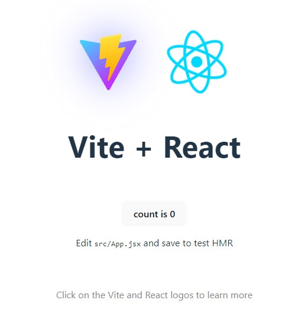

# Välkommen till Laboration 1 i Webbutveckling i React
Projektet är ett individuellt arbete.
Ni får välja själva vilken webbsida/applikation ni ska göra men nedan krav ska uppfyllas och ni måste skapa ett github repository för ert projekt.

Tänk på att hela tiden göra "commit" samt en "push", om ni är osäkra på hur man hanterar detta så är mitt tips att ni kikar på denna tutorial igen https://app.pluralsight.com/library/courses/github-getting-started/table-of-contents

Vänligen lämna in en länk till ert Github repository

För G

Sätta upp ett React projekt med create-react-app eller med Vite

Minst 3 funktionskomponenter

Ta emot och "injicera"” minst en prop

Hantera minst ett event

Använd ett formulärsfält och spara innehåll till state

Använd hooks (på ett korrekt sätt): useState & useEffect

Projektet skall starta efter npm/yarn install & npm/yarn start utan några konsoll-fel

För VG

Använd hooks: useRef
Minst 5 komponenter
Enhetligt formaterad kod (Använd https://prettier.io/ extension i VS Code)

# Currency Converter
Project idea is a currency converter, using any currency converter API such as CurrencyLayer or ExchangeRate-API to get current excange rate.

## Getting started
Project started by creating this repo. Then opened in GitHub Desktop and then opened in VS Code.  
ran command: `npm init vite@latest`  
`npm install` to install dependencies.  
Test start App with `npm run dev`
Application verified running at http://localhost:5173/  

## Labb 1 requirements.

### Components:
Create at least 5 functional components for different parts of your application, such as one for the main layout, one for input fields and buttons, one for displaying conversion results, and possibly more to handle various parts of the user interface.

### Props:
Use props to pass data between your components. For example, you can pass exchange rates as props to the component that displays conversion results.

### Events:
Implement event handling to manage user interactions, such as when they enter the amount to convert or select currencies to convert between.

### Form fields and state:
Use a form field to allow the user to enter the amount they want to convert and save the value in a state variable using the useState hook.

### Hooks:
Use the useState and useEffect hooks to manage state and effects in your application. You can use useState to store the state of the amount the user wants to convert, and useEffect to fetch current exchange rates from a currency API when the component mounts or when the currency changes.

### Ref:
Use useRef to create a reference to the input field where the user enters the amount to convert.

### Formatted code:
Ensure your code is consistently formatted by using a tool like Prettier to automatically format the code according to predefined rules.

By following these steps and implementing functionality to fetch exchange rates from an API, handle currency conversion, and dynamically update the interface based on user input, you can create a currency converter that meets the requirements of Lab 1.

# Structure
In src folder, I added "components folder".  
In components folder I added five components.  
1. ConversionResult.jsx
2. ConvertButton.jsx
3. CurrencyInput.jsx
4. LayoutComponent.jsx
5. ErrorComponent.jsx
