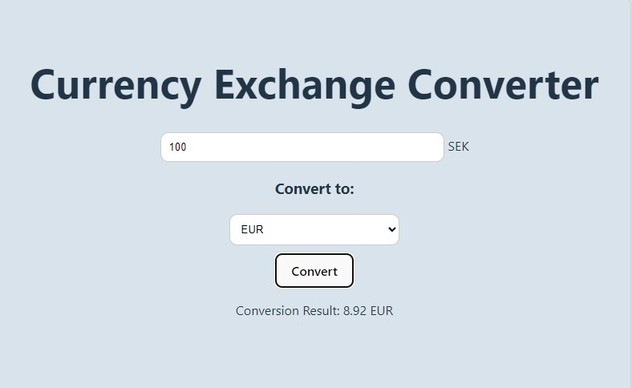

# Assignment 1 - Web Development with React at IT-Högskolan.


## Preface
### Välkommen till Laboration 1 i Webbutveckling i React
Projektet är ett individuellt arbete.
Ni får välja själva vilken webbsida/applikation ni ska göra men nedan krav ska uppfyllas och ni måste skapa ett github repository för ert projekt.  
Tänk på att hela tiden göra "commit" samt en "push", om ni är osäkra på hur man hanterar detta så är mitt tips att ni kikar på denna tutorial igen https://app.pluralsight.com/library/courses/github-getting-started/table-of-contents  
Vänligen lämna in en länk till ert Github repository

### För G
* Sätta upp ett React projekt med create-react-app eller med Vite
* Minst 3 funktionskomponenter
* Ta emot och "injicera"” minst en prop
* Hantera minst ett event
* Använd ett formulärsfält och spara innehåll till state
* Använd hooks (på ett korrekt sätt): useState & useEffect
* Projektet skall starta efter npm/yarn install & npm/yarn start utan några konsoll-fel

### För VG
* Använd hooks: useRef
* Minst 5 komponenter
* Enhetligt formaterad kod (Använd https://prettier.io/ extension i VS Code)

# Project
Project idea is a currency converter, using any currency converter API such as CurrencyLayer or ExchangeRate-API to get current excange rate.

## Getting started
Project started by creating this repo. Then opened in GitHub Desktop and then opened in VS Code.  
ran command: `npm init vite@latest`  
`npm install` to install dependencies.  
Test start App with `npm run dev`
Application verified running at http://localhost:5173/  


# Structure
In src folder, I added "components folder".  
In components folder I added five components.  
1. ConversionResult.jsx
2. ConvertButton.jsx
3. CurrencyInput.jsx
4. LayoutComponent.jsx
5. ErrorComponent.jsx

Component view using Sapling:  


# API
I used the Open Exchange Rate API to get updated currency exchange rates.  
(I had to change from CurrencyLayer API that only allowed 100 request per month, and I soon did reach 100 request when developing.)

# Error handling
In the code, there are two main error handling mechanisms:
1. Error Component: An `ErrorComponent` is rendered when an error occurs during the data fetching process in the `LayoutComponent`. This component receives an error message as a prop and displays it to the user.
3. Conditional Rendering: Error handling is implemented using conditional rendering. If an error occurs during data fetching, the `LayoutComponent` sets the `error` state, which triggers the rendering of the `ErrorComponent` to display the error message.

These mechanisms help ensure that users are informed about any errors that occur during the application's operation, providing a more user-friendly experience.

Also handling faulty user input. When the "Convert" button is clicked, the `handleConvert` function is called. This function first checks if the `inputValue` and `selectedCurrency` are empty. If either of them is empty, it sets an error state with a corresponding error message.

Here's how the error handling works in the code:
1. If the `inputValue` is empty, it sets an error state with the message "Please enter a value in SEK."
2. If the `selectedCurrency` is empty, it sets an error state with the message "Please select a currency from the dropdown menu."
3. If both `inputValue` and `selectedCurrency` are valid and present, it proceeds with the currency conversion logic.

This error handling mechanism ensures that users are prompted to provide necessary input before attempting the currency conversion, improving the user experience by providing clear feedback on what needs to be corrected. Additionally, the ErrorComponent is rendered to display the error message to the user.

# User experience
1. Entering any value in the InputField as SEK.
2. Select what currency to convert to.
3. Click "Convert" button.  


# Checking assessment criteria

### For grade G
* Set up a React project using `create-react-app` or Vite.  
Yes, used Vite as described in the Getting started section

* At least 3 function components  
Yes, I'm using 4.
    - CurrencyInput: This component handles the input for entering the currency value.
    - ConvertButton: This component represents the button used to trigger the currency conversion.
    - ConversionResult: This component displays the result of the currency conversion.
    - ErrorComponent: This component is used to display error messages when there are errors in the application.

* Recieve and inject at least one prop  
Yes, there are several. For example:  
    - CurrencyInput: Takes in the `value` and `onChange` props.
    - ConversionResult: Takes in the `result` and `currency` props.
    - ErrorComponent: Takes in the `message` prop.

* Handle at least one event  
Yes, for example, the event handling occurs in the `handleConvert` function within the `LayoutComponent` component:
```
const handleConvert = () => {
  if (exchangeRates && exchangeRates.rates && selectedCurrency) {
    calculateConversion();
  }
};
```

* Use a form field an save the content to state  
Yes, I have a form field represented by the `CurrencyInput` component, and its value is controlled by the `inputValue` state variable. The `handleInputChange` function is responsible for updating the `inputValue` state when the content of the form field changes.  

* Use hooks (in a correct way): useState & useEffect  
Yes, the code utilizes hooks, specifically `useState` and `useEffect`, in an appropriate manner.
    - `useState` is used to manage state variables such as `exchangeRates`, `inputValue`, `selectedCurrency`, `conversionResult`, and `error`.
    - `useEffect` is used to perform side effects, such as fetching exchange rates from an API and updating state accordingly.  
Therefore, the code meets the requirement of using hooks correctly.

* Project run with npm/yarn install and npm/yarn start without any console errors  
Yes. But Vite as your build tool, which typically uses `dev` for development server and `build` for creating a production build.
I added `"start": "vite",` to the package.json file to meet the requrement.  
No errors in console:  


### För VG

* Use hook: useRef  
Yes, the `useRef` hook is being used in the `CurrencyInput` component to create a reference to the input field. 
`const inputRef = useRef(null);`  
and later, it's utilized in:  
`useEffect(() => { inputRef.current.focus(); }, []);`

* At least 5 components.  
Yes.
    - `App`: The root component of the application.
    - `LayoutComponent`: Manages the layout and contains the main functionality.
    - `CurrencyInput`: Handles the input field for entering currency values.
    - `ConvertButton`: Represents the button used to trigger the currency conversion.
    - `ConversionResult`: Displays the result of the currency conversion.
    - `ErrorComponent`: Used to display error messages.

* Uniformly formatted code (Use the https://prettier.io/ extension in VS Code).  
Yes, Prettier is installed and utilized:  
